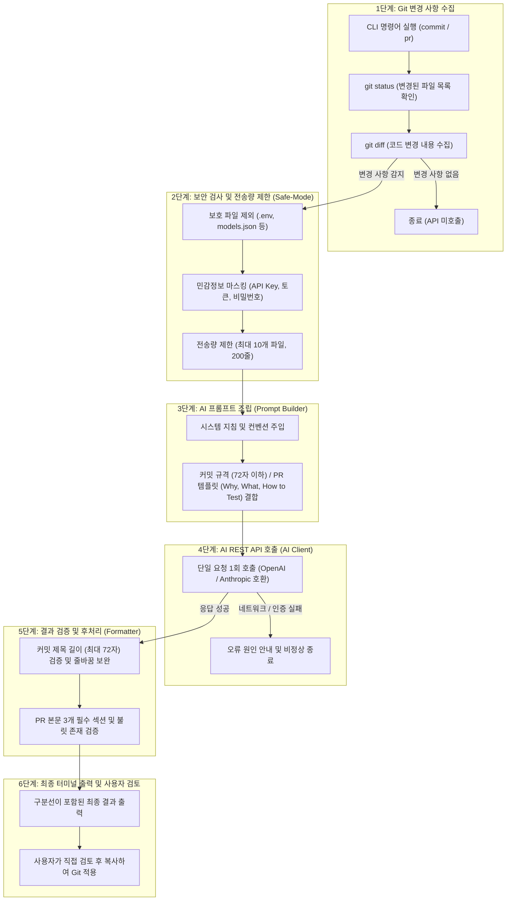

# 🟩 AI GitGen 프로젝트 전체 동작 과정 다이어그램  

  

## 🟢 1. 프로젝트 전체 파이프라인 흐름도 (Mermaid)  

  

## 🟢 2. 단계별 상세 역할 및 비유  

  

### 🟡 6단계 프로세스 요약표  

| 단계 | 모듈 명칭 | 핵심 동작 | 초등학생 비유 |
| :--- | :--- | :--- | :--- |
| **1단계** | `git_service.py` | `git status`, `git diff`를 실행하여 고친 코드만 모음 | **수첩 펼치기**: 오늘 바뀐 숙제가 무엇인지 공책에서 찾아냄 |
| **2단계** | `security.py` | 비밀 파일(`.env`) 제외, 비밀번호/키 마스킹, 200줄 자르기 | **검열관**: 편지에 적힌 집 비밀번호나 너무 긴 사연을 매직으로 지움 |
| **3단계** | `prompt_builder.py` | AI가 이해하기 쉬운 질문지와 템플릿 규칙 조립 | **편지 쓰기**: AI 천재 선생님께 보낼 예의 바른 질문 양식을 작성 |
| **4단계** | `ai_client.py` | 클라우드 AI 서버에 REST API로 딱 1번만 요청 전송 | **우체부**: 편지를 들고 구름 나라(AI 서버)에 딱 한 번 다녀옴 |
| **5단계** | `formatter.py` | 제목 글자 수가 넘치거나 PR 문단이 빠졌는지 검사하고 보완 | **선생님 채점**: 글자 수가 너무 길거나 필수 숙제가 빠졌는지 검사하고 다듬음 |
| **6단계** | `cli.py` | 완성된 커밋/PR 문구를 터미널 화면에 예쁘게 출력 | **게시판 출력**: 최종 확인을 위해 칠판에 붙여서 사람에게 보여줌 |

  

## 🟢 3. 핵심 안전 장치 (Fail-Safe)  

- **과금 방지**: 한 번 실행할 때 AI API를 무조건 정확히 **1회**만 호출한다.  
- **코드 안전**: AI 프로그램은 자동으로 `git commit`이나 `git push`를 실행하지 않으며, 사람이 검토할 수 있도록 **텍스트 초안만 출력**한다.  
- **도커 환경 안전**: Docker 실행 시 호스트 볼륨을 **읽기 전용(`:ro`)**으로 마운트하여 컨테이너가 원본 코드를 망가뜨리지 못하게 원천 봉쇄한다.  
